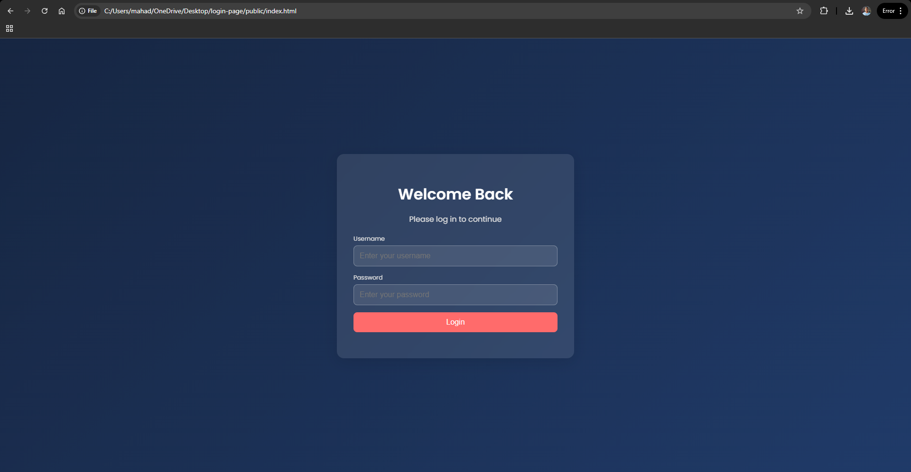
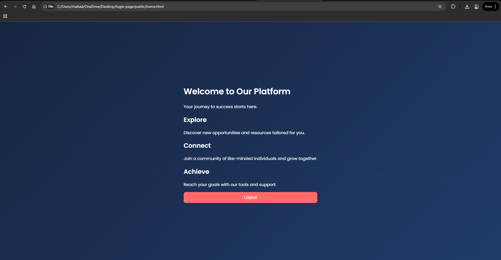

# Login Page with MySQL Backend 🚀
### Login Page

### Home Page

A fully functional login page with a modern design, built using **Node.js**, **Express.js**, and **MySQL**. This project demonstrates seamless integration of frontend, backend, and database for user authentication.

---

## ✨ Features

- **Frontend:**
  - Clean, responsive, and modern UI.
  - Smooth animations and gradient background.
  - Works flawlessly on all devices (desktop, tablet, mobile).

- **Backend:**
  - Built with **Node.js** and **Express.js**.
  - Secure login endpoint to validate user credentials.

- **Database:**
  - **MySQL** integration to store and fetch user data.

- **User Experience:**
  - Real-time feedback for invalid login attempts.
  - Redirects to a home page on successful login.
  - Logout functionality to end the session.

---

## 🛠 Tech Stack

- **Frontend:** HTML5, CSS3, JavaScript
- **Backend:** Node.js, Express.js
- **Database:** MySQL
- **Styling:** Google Fonts (Poppins), CSS Animations, Media Queries

